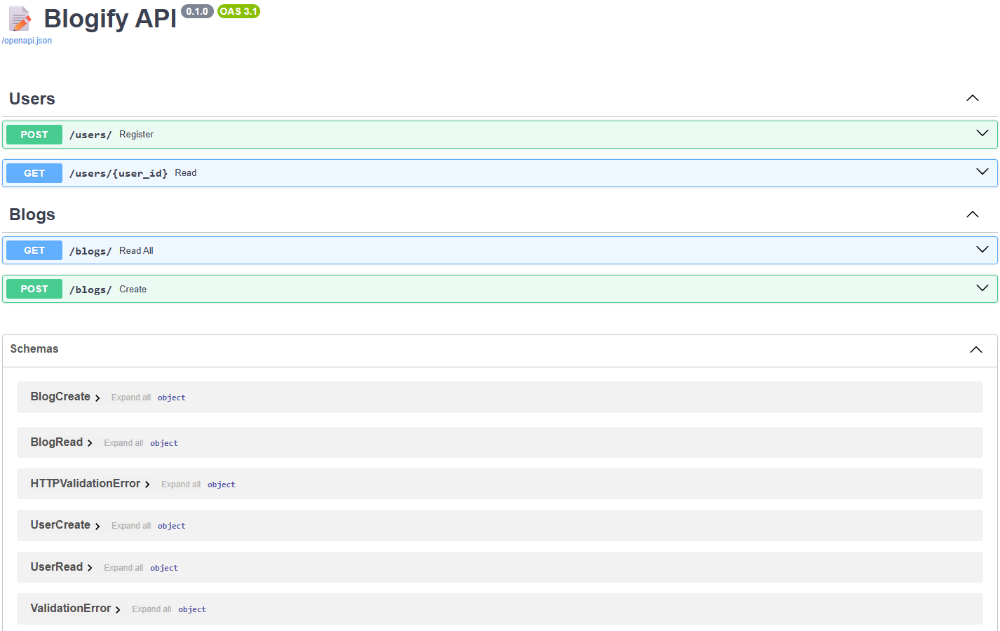

# 📝 Blogify API

A blog management API built using FastAPI, SQLModel, and JWT Auth.



## Features

- 🧾 User registration
- ✍️ Blog creation and listing
- 🔒 JWT-based authentication
- 🧂 Password hashing
- 🚀 Async support
- 🔎 Pagination and filtering (WIP)
- 🧪 Unit tests with `pytest`

## Quick Start

### 1. Clone & Setup

```bash
git clone <repo-url>
cd blogify-api
python -m venv venv
source venv/bin/activate  # or venv\Scripts\activate
pip install -r requirements.txt
```

### 2. Configure Environment

Update `.env` with your DB string (e.g. SQLite/MySQL/PostgreSQL)

```env
DATABASE_URL=sqlite:///./blog.db
```

### 3. Run App

```bash
uvicorn app.main:app --reload
```

Visit: [http://127.0.0.1:8000/docs](http://127.0.0.1:8000/docs)

## Project Structure

```
blogify-api/
├── app/
│   ├── routes/
│   ├── main.py
│   ├── models.py
│   ├── ...
├── tests/
├── .env
├── README.md
```

## Testing

```bash
pytest
```

## Author

Sumit Kumar
