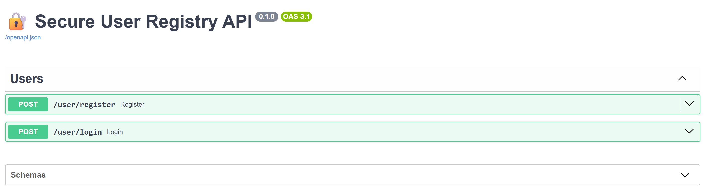

# 🔐 Project: Secure User Registry API

A FastAPI API that allows users to register, login, and view their profile — ensuring PII such as passwords, emails, etc., are securely stored and protected.

